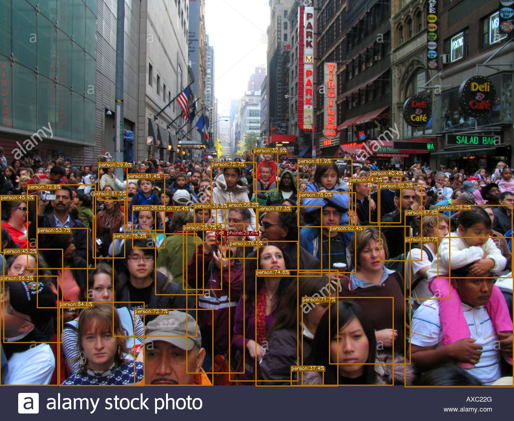
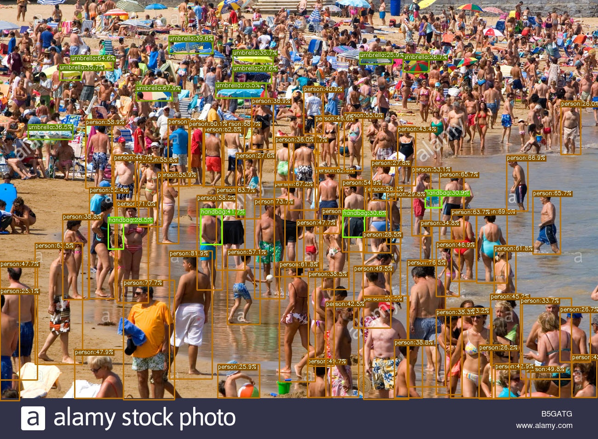
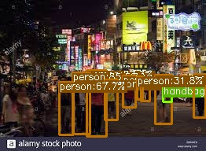
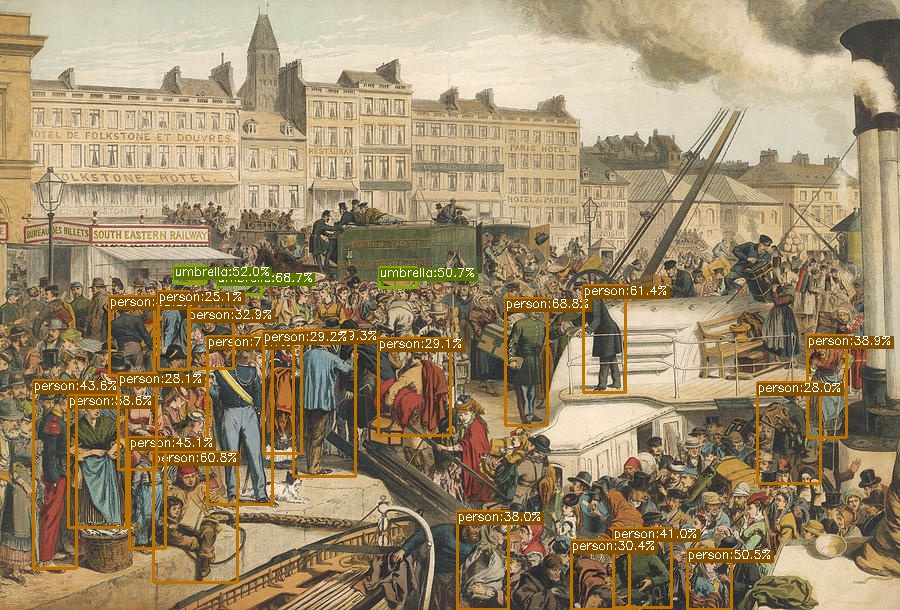
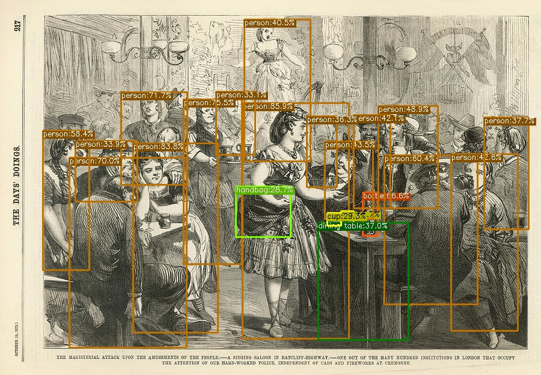

* Frankly, I didn't need to write a code to test the model as the original repository contains the whole needed codes, i.e., inference code for images, videos, and webcams.
* However, I designed some corner cases to test the model robustness. i.e., crowded, night, synthetic, and blurred scenes.

# YOLOX Visualizations:
* The whole reported results are produced using YOLOX-S.
* The failure cases only is studied again using YOLOX-X as it is the most powerful variant.

------------------
## Crowded Scenes:
| Input             |  Output |
:-------------------------:|:-------------------------:
  |  
  |  
  |  

### Failure cases:
| Input             |  Output-S |   Output-X |
:-------------------------:|:-------------------------:|:-------------------------:
  |  |  
  |  |  

------------------
## Night Scenes:
| Input             |  Output |
:-------------------------:|:-------------------------:
  |  

### Failure cases:
| Input             |  Output-S |Output-X |
:-------------------------:|:-------------------------:|:-------------------------:
  |  |  

------------------
## Synthetic Scenes:
| Input             |  Output |
:-------------------------:|:-------------------------:
  |  
  |  
  |  
  |  
  |  
  |  

### Failure cases:
| Input             |  Output-S |  Output-X |
:-------------------------:|:-------------------------:|:-------------------------:
  |  |  
  |  |  

------------------
## Blurring Scenes:
| Input             |  Output |
:-------------------------:|:-------------------------:
  |  
  |  

### Failure cases:
| Input             |  Output-S | Output-X |
:-------------------------:|:-------------------------:|:-------------------------:
  |    |  
  |    |  

# Quick Insights from Results:
* In general, YOLOX-small surprisingly performs well in difficult situations like synthetic, night, crowded, and blurring.
* YOLOX-X-Large has boosted the performance in the night and blurring failure cases, however still fails, or maybe we can say perform worse than the small version on synthetic and crowded scenes.

# Steps to solve the task with an approximated time for each step:
| Steps             |  Approximated time |
:-------------------------:|:-------------------------:
Skim YOLOX report          |     30 Mins
Read YOLOX report in details and create the mind map          |     2.5 Hours
Read OTA[4] paper          |     1 Hours
Clone the code and create an anaconda environment          |     30 Mins
Design and run my testcases and write the readme          |     2.5 Hours

# Criticising the paper:
[Please refer to this mind map](https://mm.tt/1992748152?t=SWCMNTa0P7)

